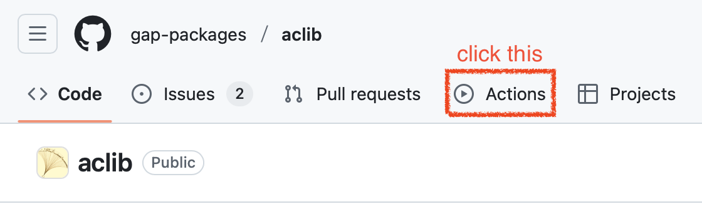
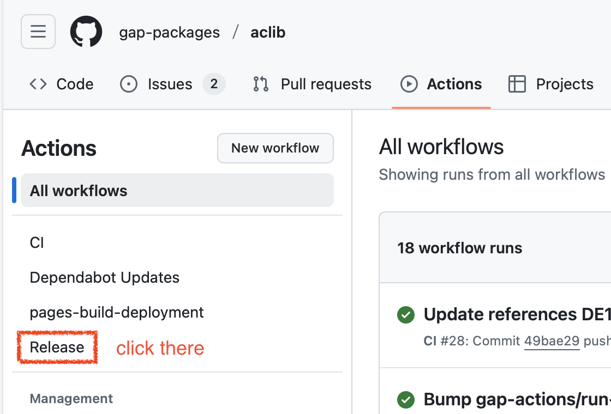
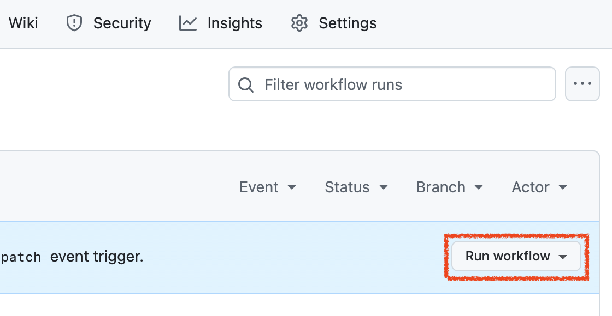
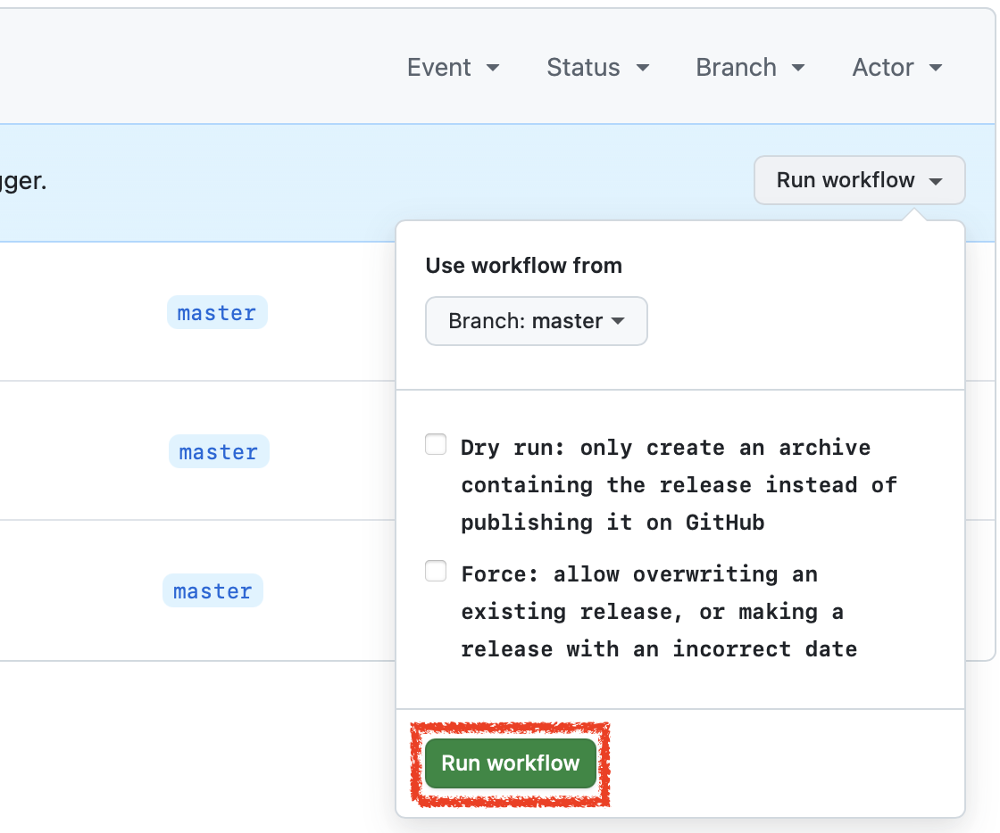

# release-pkg

This GitHub action helps making releases of a GAP package.
It creates release archives and publishes them in a GitHub release.

## Usage

Once this action has been properly set up in a GitHub Actions workflow
for your GAP package (as described in the subsequent sections of this
document), you can make a new release of your package by following
these steps:

1. Update the version and release date in `PackageInfo.g` and anywhere
   else it appears (e.g. a changelog file).

2. Navigate to the `Actions` tab of your package's GitHub repository.<br>
   

3. On the left side is a list of all workflows configured for your package.
   Locate the "Release" workflow and click on it.<br>
   

4. Now towards the right side of your browser window, a button "Run workflow"
   should have appeared; click it.<br>
   

5. The click should have revealed a new box with a big green button also labelled
   "Run workflow". Once again, click it.<br>
   

If everything is configured right, the new release of your package should
appear on GitHub and your package's website within a few minutes.

> [!CAUTION]
> We recommend a 'dry run' the first time you use this workflow.
> This will create an archive containing the release, which can be downloaded under
> the `Artifacts` in the relevant run of this workflow, but not actually publish the
> release. You can then inspect the release archive and, if satisfactory, re-run this
> workflow without the 'dry run' option.


## Initial setup

The action `release-pkg` has to be called by a GitHub workflow of a GAP
package. The recommend way to do that is to create a file `release.yml` in the
`.github/workflows/` folder of your package repository.

Below we provide a template that you can use as-is in your package. You can
also customize it to suite your specific needs. But for now, if you add and
commit this as a file `.github/workflows/release.yml` to your repository
(don't forget to also push it out to Github), you should immediately
afterwards be able to follow the instructions in the "Usage" section at the
start of this document to make a release.

> [!CAUTION]
> By default `update-gh-pages` regenerates the `gh-pages` branch of your
> repository from scratch. If you made custom modifications to that branch,
> you need to disable this behavior. Please consult [the documentation of
> `update-gh-pages`][2] for details.


```yaml
name: Release

on:
  workflow_dispatch:
    inputs:
      dry-run:
        description: "Dry run: only create an archive containing the release instead of publishing it on GitHub"
        type: boolean
        required: false
        default: false
      force:
        description: "Force: allow overwriting an existing release, or making a release with an incorrect date"
        type: boolean
        required: false
        default: false

permissions: write-all

jobs:
  release:
    name: "Release the GAP package"
    runs-on: ubuntu-latest

    steps:
      - uses: actions/checkout@v5
      - uses: gap-actions/setup-gap@v3
      - uses: gap-actions/build-pkg-docs@v2
        with:
          use-latex: true
      - uses: gap-actions/release-pkg@v1
        with:
          dry-run: ${{ inputs.dry-run }}
          force: ${{ inputs.force }}
      - uses: gap-actions/update-gh-pages@v1
        if: ${{ !inputs.dry-run }}
```

We recommend that you start with this template in your package and refine
it as needed. For example you could insert an additional `run` step before
`release-pkg` to perform additional work before creating the release archives,
such as compressing data files (the `smallgrp` package does that in its
[release workflow](https://github.com/gap-packages/smallgrp/blob/master/.github/workflows/release.yml)),
or deleting files that should not end up in the release archives.

By default, this action will fail if there already exists a release
with the same version number, or if the date in `PackageInfo.g` is more
than 1 day off from the current date. These safety checks can be turned
off using the `force` input.

### Inputs

All of the following inputs are optional.

- `dry-run`:
  - Set to `true` to *not* publish the archive this release creates as a GitHub
    release. Useful for testing. (The created archive can still be downloaded
    from the GitHub web interface if you navigate to the "Action" section and
    from there to the relevant run of your workflow.)
  - default: `false`
- `force`:
  - Set to `true` to allow this action to overwrite an existing
    release, or to make a release with an incorrect date. Use with caution.
  - default: `false`
- `body-text`: 
  - Body text for the new GitHub release that will appear on the package's GitHub
    Releases page.
  - default: "Release of &lt;repository name&gt;"
### Examples

Examples of actual GAP packages using this action include
[aclib](https://github.com/gap-packages/aclib) and
[polycyclic](https://github.com/gap-packages/polycyclic).

### Migration from ReleaseTools

If you have been using [ReleaseTools][1] so far to make releases of your package,
here are a few notes that may be helpful.

 - It is not necessary to provide a token. This action will automatically
   use your repository's `GITHUB_TOKEN`.
 - The documentation **will not** be compiled during this action. This must
   be done in a separate step in the release workflow, e.g. by the action
   [build-pkg-docs][3], as shown in the `release.yml` template elsewhere in
   this document.
 - If your package has a `.release` script, this **will not** be executed.
   Instead, add a separate step in your release workflow, before this action.
   This step can either invoke your `.release` script, or you can copy the
   content of that script into the step and delete the script afterwards.
 - The GitHub Pages **will not** be updated. However this can be done by the
   [update-gh-pages](https://github.com/gap-actions/update-gh-pages) action.
   This is also demonstrated in the template.

## What this action actually does

This action takes the code for your package and turns it into an archive
(tarball or zipfile) suitable for use by the GAP package distribution or
GAP end users. It also uploads this archive to the GitHub release system,
where it can be downloaded from.

To do so, it extracts metadata of your package from the `PackageInfo.g` file:
- The name that should be given to the release archives (from `ArchiveUrl`).
- The git tag that should be used to create the release (from `ArchiveUrl`).
- The name of the package (from `PackageName`). Used in the title of the release.
- The version of the package (from `Version`). Used in the title of the release, and to prevent you from accidentally making a release with "dev" in the version string.
- The archive formats that need to be created (from `ArchiveFormats`).
- Which PDF files should be attached to the release (from `PackageDoc[].PDFFile`).
- The date the package should be released (from `Date`). Used to prevent making a release on the wrong date, which usually indicates the author forgot to update this in `PackageInfo.g`.

It also performs a series of additional sanity checks to catch mistakes. Any
failures here generally abort the release with a suitable error:
- As already stated, it checks that the date given in `PackageInfo.g` is
  plausible (which should be the current date; but we accept the day before or
  after as well to deal with edge cases)
- It calls the GAP function `ValidatePackageInfo`.
- It rejects all symlinks, and files with names causing issues on some systems.
- It rejects two files in the same directory having names that are equal up to
  case differences.

In addition to uploading the archive to a GitHub release, this action also
creates the necessary git tag, and uploads PDFs of all built package manuals.
However, it does not compile your manual. this must be done in a separate step
in the release workflow, e.g. by the action [build-pkg-docs][3], as shown in
the `release.yml` template elsewhere in this document.

## Contact
Please submit bug reports, suggestions for improvements and patches via
the [issue tracker](https://github.com/gap-actions/release-pkg/issues).

## License
The action `release-pkg` is free software; you can redistribute
and/or modify it under the terms of the GNU General Public License as published
by the Free Software Foundation; either version 2 of the License, or (at your
opinion) any later version. For details, see the file `LICENSE` distributed
with this action or the FSF's own site.


[1]: https://github.com/gap-system/ReleaseTools
[2]: https://github.com/gap-actions/update-gh-pages
[3]: https://github.com/gap-actions/build-pkg-docs
