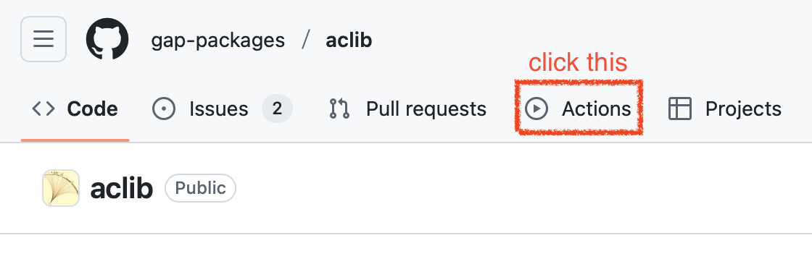
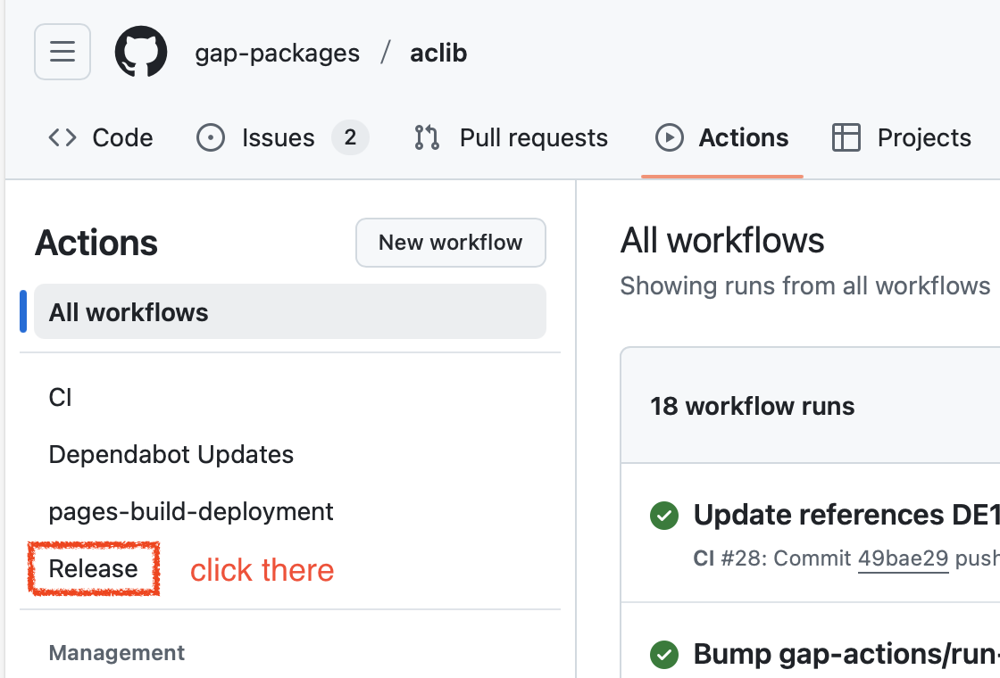
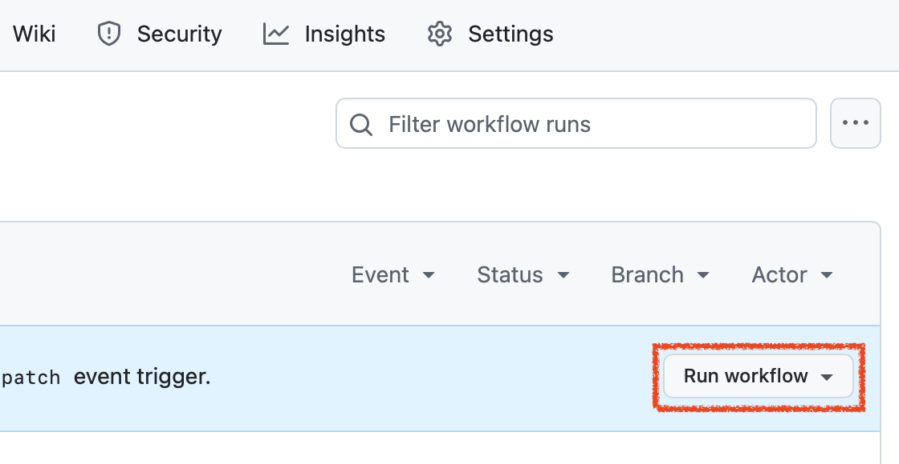
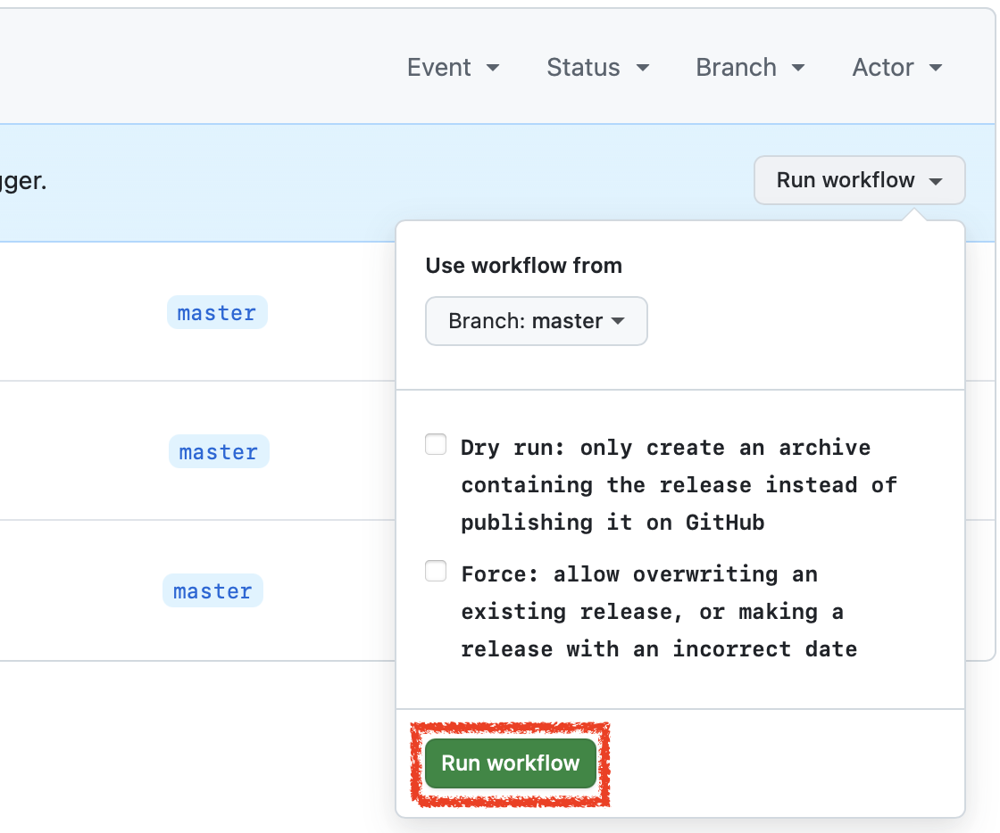

# release-pkg

This GitHub action helps make releases of a GAP package.
It creates release archives and publishes them in a GitHub release.

## Usage

Once this action has been properly set up in a GitHub Actions workflow
for your GAP package (as described in the subsequent sections of this
document), you can make a new release of your package by following
these steps:

1. Update the version and release date in `PackageInfo.g` and anywhere
   else it appears (e.g. a changelog file).

2. Navigate to the `Actions` tab of your package's GitHub repository.<br>
   

3. On the left side is a list of all workflows configured for your package.
   Locate the "Release" workflow and click on it.<br>
   

4. Now towards the right side of your browser window, a button "Run workflow"
   should have appeared; click it.<br>
   

5. The click should have revealed a new box with a big green button also labelled
   "Run workflow". Once again, click it.<br>
   

If everything is configured correctly, the new release of your package should
appear on GitHub and your package's website within a few minutes.

> [!CAUTION]
> We recommend the first time you use this workflow to select the 'Dry run' option
> in the final step above.
> This will create an archive containing the release, which can be downloaded under
> the `Artifacts` in the relevant run of this workflow, but will not actually publish the
> release. You can then inspect the release archive and, if satisfactory, re-run this
> workflow without the 'Dry run' option.


## Initial setup

The action `release-pkg` has to be called by a GitHub workflow of a GAP
package. The recommended way to do that is to create a file `release.yml` in the
`.github/workflows/` folder of your package repository.

Below we provide a template that you can use as-is in your package. You can
also customize it to suit your specific needs. But for now, if you add and
commit this as a file `.github/workflows/release.yml` to your repository
(don't forget to also push it out to GitHub), you should immediately
afterwards be able to follow the instructions in the "Usage" section at the
start of this document to make a release.

> [!CAUTION]
> By default `update-gh-pages` regenerates the `gh-pages` branch of your
> repository from scratch. If you made custom modifications to that branch,
> you need to disable this behavior. Please consult [the documentation of
> `update-gh-pages`][2] for details.


```yaml
name: Release

on:
  workflow_dispatch:
    inputs:
      dry-run:
        description: "Dry run: only create an archive containing the release instead of publishing it on GitHub"
        type: boolean
        required: false
        default: false
      force:
        description: "Force: allow overwriting an existing release, or making a release with an incorrect date"
        type: boolean
        required: false
        default: false

permissions: write-all

jobs:
  release:
    name: "Release the GAP package"
    runs-on: ubuntu-latest

    steps:
      - uses: actions/checkout@v6
      - uses: gap-actions/setup-gap@v3
      - uses: gap-actions/build-pkg-docs@v2
        with:
          use-latex: true
      - uses: gap-actions/release-pkg@v1
        with:
          dry-run: ${{ inputs.dry-run }}
          force: ${{ inputs.force }}
      - uses: gap-actions/update-gh-pages@v1
        if: ${{ !inputs.dry-run }}
```

We recommend that you start with this template in your package and refine
it as needed. For example you could insert an additional `run` step before
`release-pkg` to perform additional work before creating the release archives,
such as compressing data files (the `smallgrp` package does that in its
[release workflow](https://github.com/gap-packages/smallgrp/blob/master/.github/workflows/release.yml)),
or deleting files that should not end up in the release archives.

By default, this action will fail if there already exists a release
with the same version number, or if the date in `PackageInfo.g` is more
than 1 day off the current date. These safety checks can be turned
off using the `force` input.

### Inputs

All of the following inputs are optional.

- `dry-run`:
  - Set to `true` to *not* publish the archive this release creates as a GitHub
    release. Useful for testing. (The created archive can still be downloaded
    from the GitHub web interface if you navigate to the "Actions" section and
    from there to the relevant run of your workflow.)
  - default: `false`
- `force`:
  - Set to `true` to allow this action to overwrite an existing
    release, or to make a release with an incorrect date. Use with caution.
  - default: `false`
- `body-text`: 
  - Body text for the new GitHub release that will appear on the package's GitHub
    Releases page.
  - default: "Release of &lt;repository name&gt;"
### Examples

Examples of actual GAP packages using this action include
[aclib](https://github.com/gap-packages/aclib) and
[polycyclic](https://github.com/gap-packages/polycyclic).

### Migration from ReleaseTools

If you have been using [ReleaseTools][1] so far to make releases of your package,
here are a few notes that may be helpful.

 - It is not necessary to provide a token. This action will automatically
   use your repository's `GITHUB_TOKEN`.
 - The documentation **will not** be compiled during this action. This must
   be done in a separate step in the release workflow, e.g. by the action
   [build-pkg-docs][3], as shown in the `release.yml` template elsewhere in
   this document.
 - If your package has a `.release` script, this **will not** be executed.
   Instead, add a separate step in your release workflow, before this action.
   This step can either invoke your `.release` script, or you can copy the
   content of that script into the step and delete the script afterwards.
 - GitHub Pages **will not** be updated. However, this can be done by the
   [update-gh-pages](https://github.com/gap-actions/update-gh-pages) action.
   This is also demonstrated in the template.

## What this action actually does

This action creates release archives for a GAP package and either

- uploads them, together with the package manuals, to a GitHub release; or
- in dry-run mode, stores the same files as a workflow artifact instead.

### Metadata read from `PackageInfo.g`

The action reads `PackageInfo.g`, converts it to JSON, and uses the following
fields. The resulting `package-info.json` is also kept as a release asset:

- `ArchiveURL`: this must point to a GitHub release download URL of the form
  `https://github.com/<owner>/<repo>/releases/download/<tag>/<basename>`.
  The action extracts both the release tag (`<tag>`) and the archive base name
  (`<basename>`) from this URL.
- `PackageName`: used for the GitHub release title and dry-run artifact names.
- `Version`: used for the GitHub release title and dry-run artifact names.
  Versions ending in `dev` are rejected.
- `ArchiveFormats`: decides which archives are created. The action supports
  `.tar.gz`, `.tar.bz2`, and `.zip`.
- `PackageDoc[].PDFFile`: each listed PDF is copied into the release assets.
- `Date`: checked against the current date, unless `force: true` is used.

### Checks performed before creating archives

Before packaging, the action

- validates the `dry-run` and `force` inputs;
- runs `ValidatePackageInfo("PackageInfo.g")` in GAP;
- rejects HTML documentation containing absolute links such as
  `href="/..."` or `href="file:/..."`;
- checks whether the release tag already exists on GitHub and refuses to
  overwrite it unless `force: true` is set;
- checks that `Date` matches today, yesterday, or tomorrow;
- rejects symlinks anywhere in the packaged tree;
- rejects Windows-incompatible file names, including reserved device names,
  names ending in a space or period, illegal characters, and case-only name
  clashes.

### Files that go into the release archives

The action first copies the package tree to a temporary directory and builds the
release from that copy. This is deliberate, so later workflow steps still see
the original checkout unchanged.

The copy step uses `cp -r . ...`, so top-level dotfiles and dot-directories are
copied into the temporary release tree as well.

After copying, the action removes some release-irrelevant files from the copied
tree if they are present there, including version-control metadata, common CI
configuration files such as `.circleci`, `.codecov.*`, `.travis.*`,
`.appveyor.*`, `azure-pipelines.*`, `.gaplint.*`, `requirements.txt`,
and macOS `.DS_Store` files.
This list is not meant to be exhaustive; for the exact cleanup commands, see
[`action.yml`](./action.yml). The cleanup removes such selected top-level
dotfiles and directories again before the final archives are created.

### `autogen.sh`

If the copied package contains an executable `autogen.sh`, the action installs
`autoconf`, `automake`, and `build-essential` via `apt-get`, runs
`sh autogen.sh`, and then removes `autom4te.cache`.

### Outputs and publication

For each format listed in `ArchiveFormats`, the action creates an archive named
`<basename><extension>` using the basename extracted from `ArchiveURL`.

If `dry-run: false` (the default), the action creates or updates a GitHub
release in the same repository, using the extracted tag, and uploads all
generated archives, the generated `package-info.json`, and the manual PDFs as
release assets.

If `dry-run: true`, the action does not publish a GitHub release. Instead, it
uploads the generated archives, the generated `package-info.json`, the manual
PDFs, and the supplied `body-text` as a workflow artifact.

This action does not build package manuals; do that in a prior workflow step,
for example via [build-pkg-docs][3], because this action assumes the manuals
already exist when it copies the PDF files into the release assets.

This action also does not update a package website or `gh-pages` branch. That
is intentional: website publication is handled separately by
[update-gh-pages][2], so packages with custom hosting or custom website steps
can keep full control over that part of the release process. In the standard
workflow shown above, `release-pkg` runs before `update-gh-pages`, and a
successful package release is therefore a prerequisite for publishing the
updated package website.

## Contact
Please submit bug reports, suggestions for improvements and patches via
the [issue tracker](https://github.com/gap-actions/release-pkg/issues).

## License
The action `release-pkg` is free software; you can redistribute
and/or modify it under the terms of the GNU General Public License as published
by the Free Software Foundation; either version 2 of the License, or (at your
opinion) any later version. For details, see the file `LICENSE` distributed
with this action or the FSF's own site.


[1]: https://github.com/gap-system/ReleaseTools
[2]: https://github.com/gap-actions/update-gh-pages
[3]: https://github.com/gap-actions/build-pkg-docs
